<div align="center">

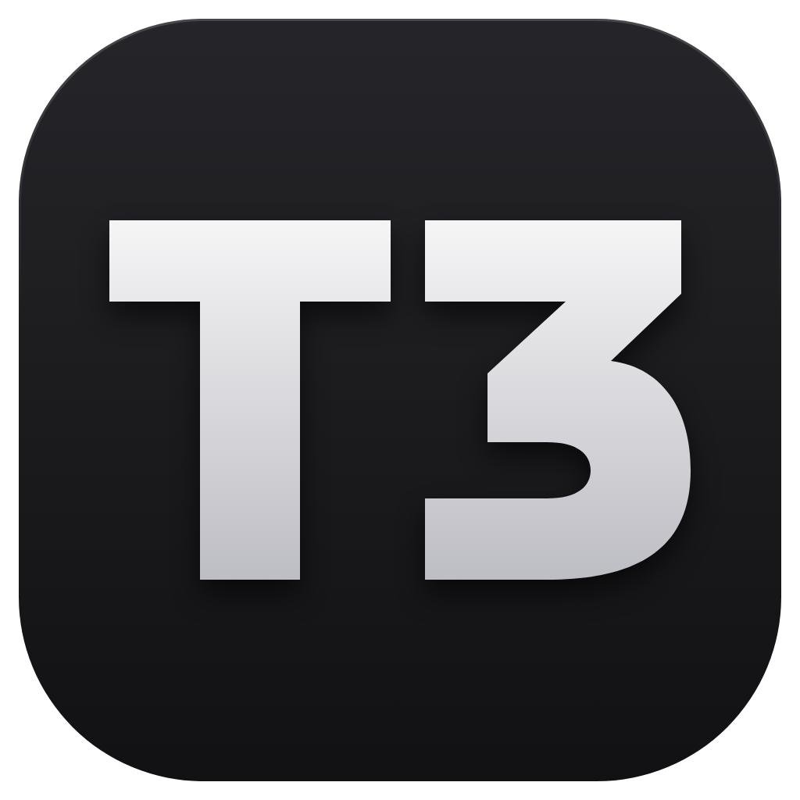 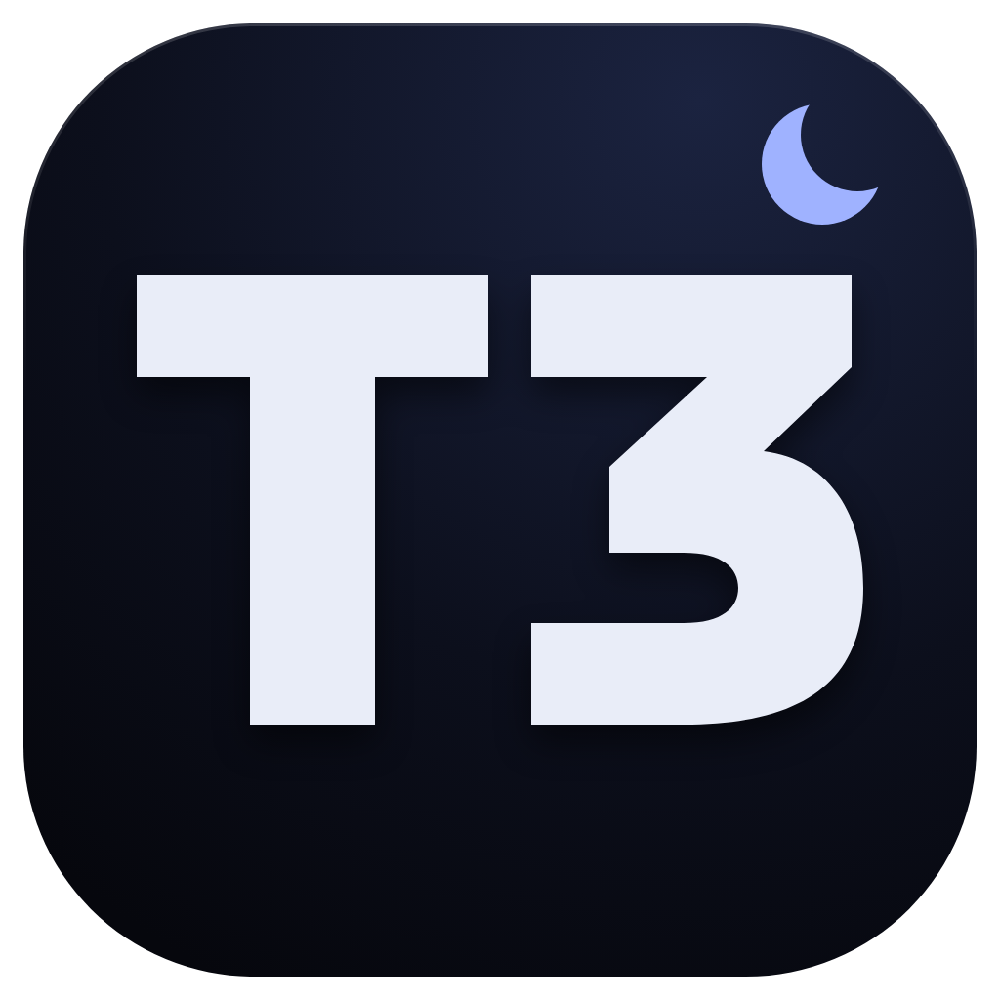 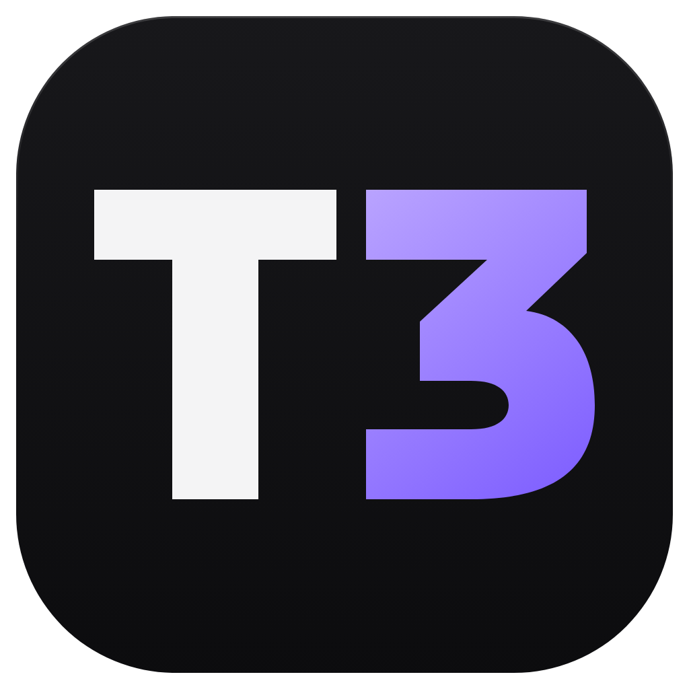 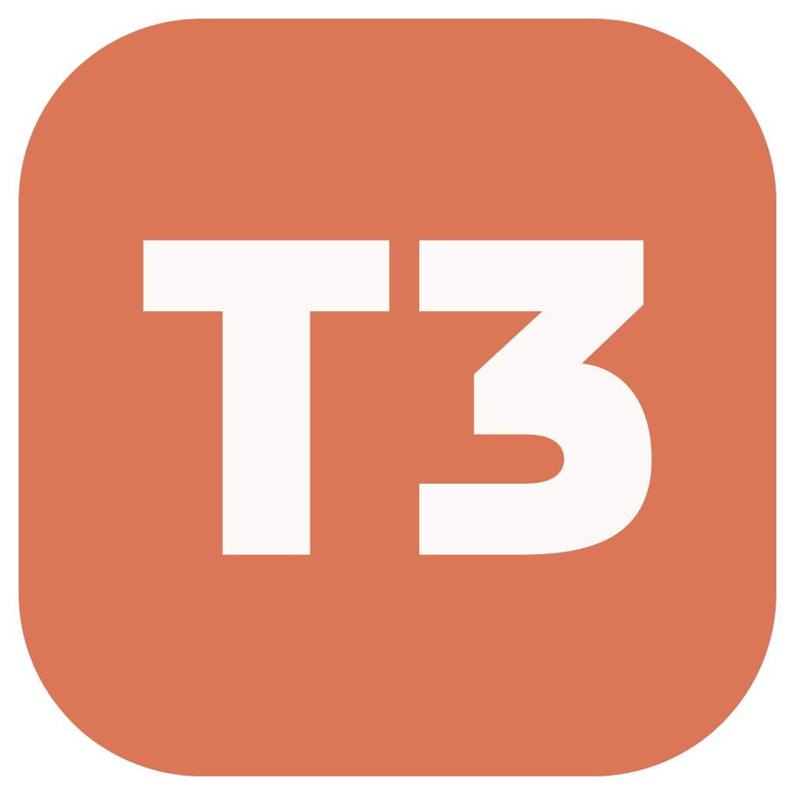 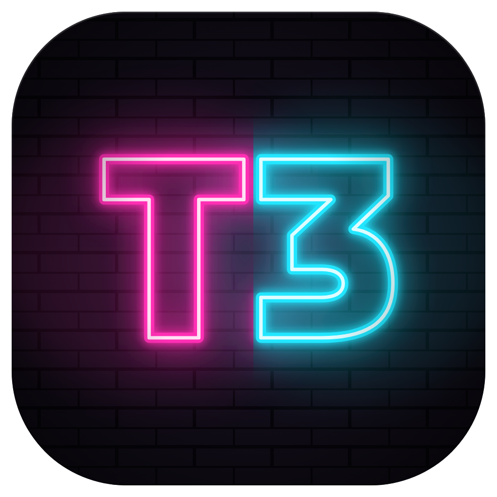 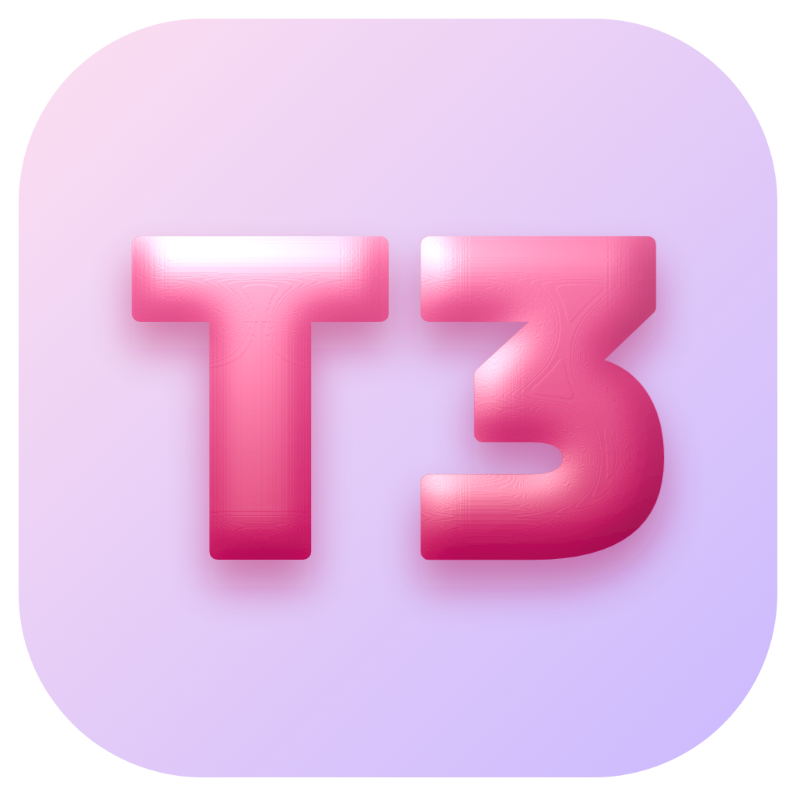 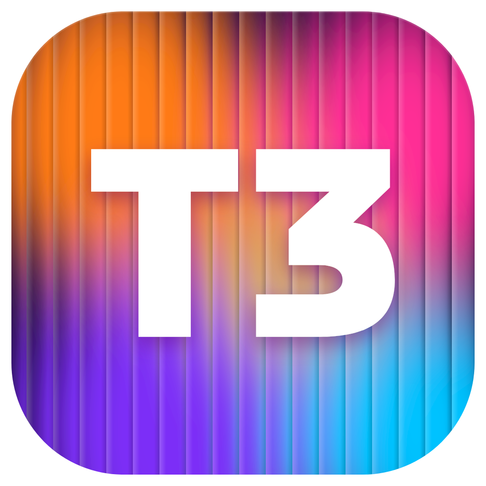 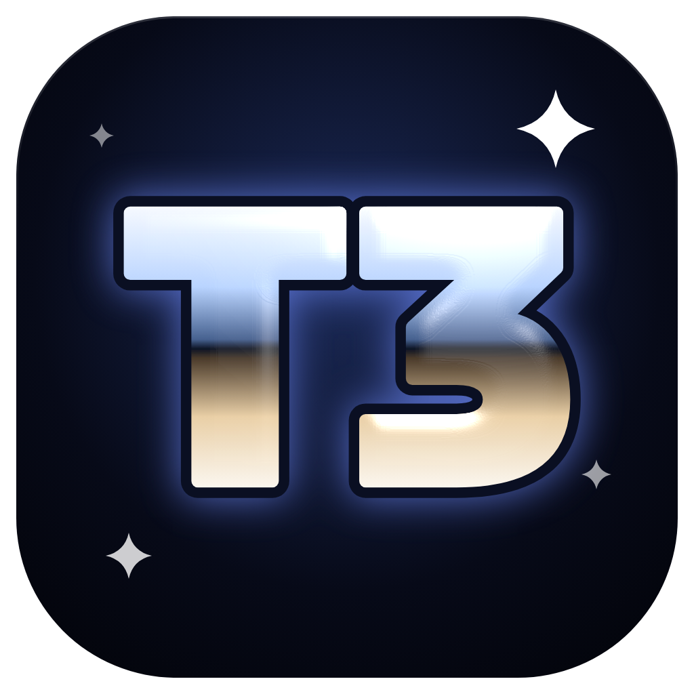 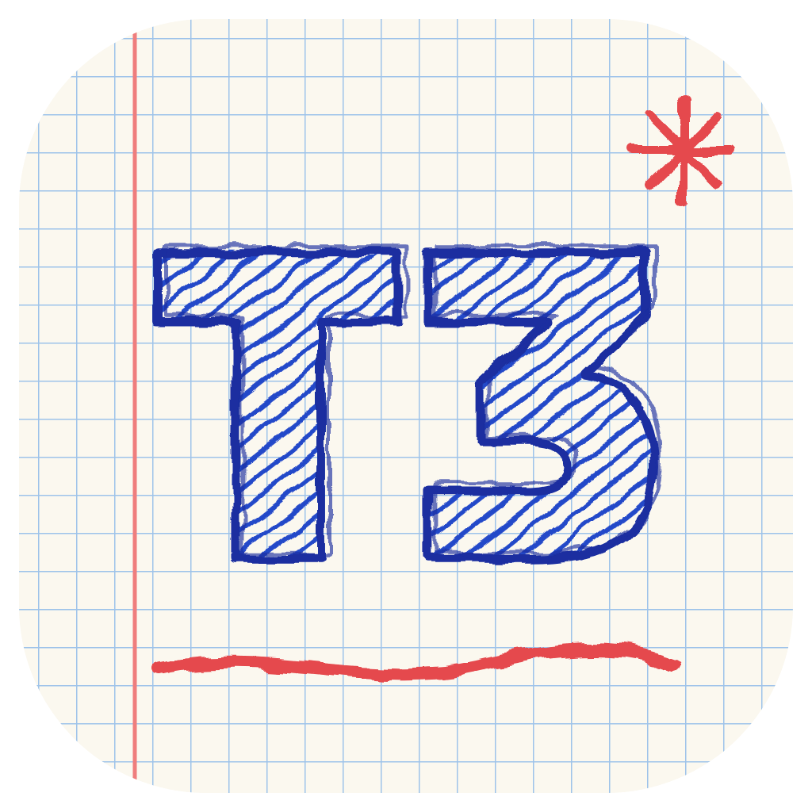 

# t3code-icons

Replacement icons for [T3 Code](https://github.com/pingdotgg/t3code), made because the nightly build's icon was a bit much.

**10 variants** · SVG · PNG · ICO · one Python script

</div>

## Core set

Quiet dark tiles that sit well in a taskbar.

<table>
<tr>
<td align="center" valign="top" width="25%"><br><b><code>graphite</code></b><br><sub>Charcoal tile, silver T3. The clean one.</sub></td>
<td align="center" valign="top" width="25%"><br><b><code>midnight</code></b><br><sub>Navy-black with a small crescent, a quiet nod to "nightly".</sub></td>
<td align="center" valign="top" width="25%"><br><b><code>accent</code></b><br><sub>Near-black, white T, violet 3.</sub></td>
<td align="center" valign="top" width="25%"><br><b><code>coral</code></b><br><sub>Flat Claude coral and ivory, made to sit next to the Claude app.</sub></td>
</tr>
</table>

## Stylised set

Louder alternate icons in the spirit of Arc's app icons. Each one is a different material.

<table>
<tr>
<td align="center" valign="top" width="33%"><br><b><code>neon</code></b><br><sub>Pink and cyan neon tubing on a dark brick wall.</sub></td>
<td align="center" valign="top" width="33%"><br><b><code>gummy</code></b><br><sub>Glossy raspberry jelly on a pastel tile.</sub></td>
<td align="center" valign="top" width="33%"><br><b><code>fluted</code></b><br><sub>Sunset gradient behind ribbed fluted glass.</sub></td>
</tr>
<tr>
<td align="center" valign="top"><br><b><code>chrome</code></b><br><sub>Y2K liquid chrome with sparkles.</sub></td>
<td align="center" valign="top"><br><b><code>sketch</code></b><br><sub>Ballpoint doodle on graph paper.</sub></td>
<td align="center" valign="top"><br><b><code>pixel</code></b><br><sub>32×32 pixel art, so it's pixel-perfect at 32px.</sub></td>
</tr>
</table>

<details>
<summary><b>See them at taskbar sizes</b> (48, 32 and 16px)</summary>
<br>

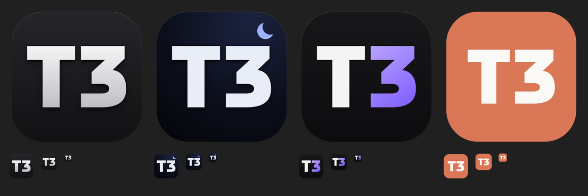

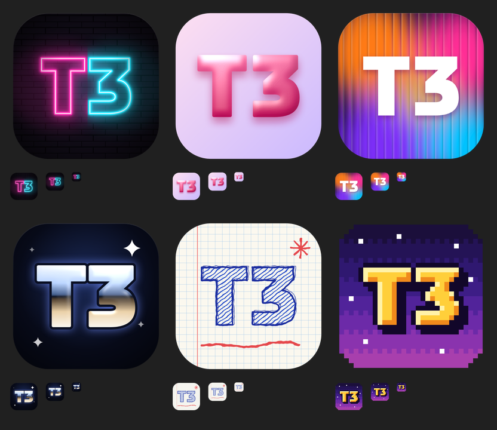

</details>

Each variant in [`icons/`](icons) comes as `.svg` (source), `.png` (1024px) and `.ico` (16–256px, for Windows).

## Using one on Windows

1. Right-click the T3 Code shortcut and open **Properties**.
2. Click **Change Icon…** and pick the `.ico`.
3. For a pinned taskbar icon, do the same to the shortcut in `%APPDATA%\Microsoft\Internet Explorer\Quick Launch\User Pinned\TaskBar`.

Or from PowerShell:

```powershell
$lnk = (New-Object -ComObject WScript.Shell).CreateShortcut("$env:USERPROFILE\Desktop\T3 Code.lnk")
$lnk.IconLocation = "C:\path\to\midnight.ico,0"
$lnk.Save()
```

> [!NOTE]
> This only changes shortcuts. The running app's window and unpinned taskbar button still use the icon built into the executable.

## Regenerating

The glyph is hand-drawn as SVG paths in [`gen.py`](gen.py). The core variants are just a background and fill on top of it. The stylised set gets its materials from SVG filters (lighting, displacement and noise); the pixel icon is rasterised from the same glyph. Edit them there and run:

```sh
pip install pillow
python gen.py            # all variants (or: python gen.py midnight)
```

It renders through headless Chrome, so set `CHROME=/path/to/chrome` if it isn't at the default Windows location.
